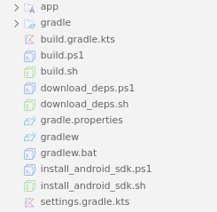
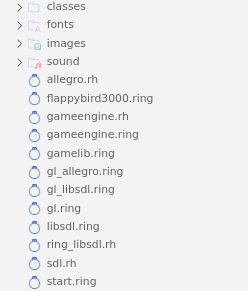

# Building Games For Android

We will learn about building RingLibSDL games for mobile. This will allow us to create Android packages (`.apk` or `.aab`) for applications developed using the Ring Game Engine for 2D games.

RingLibSDL is a binding that connects the Ring programming language with the Simple DirectMedia Layer (SDL) library, providing a powerful framework for creating cross-platform games and multimedia applications.

## Table of Contents

- [Prerequisites](#prerequisites)
- [Automated Setup using Scripts](#automated-setup-using-scripts)
- [Environment Setup](#environment-setup)
- [Download Third-Party Library Sources](#download-third-party-library-sources)
- [Project Folder](#project-folder)
- [Building the Project](#building-the-project)
- [Troubleshooting](#troubleshooting)
- [Next Steps](#next-steps)

## Prerequisites

Before you begin, you need to have the necessary development tools installed on your system.

- **Android Studio**
  The recommended way to get the Android SDK, NDK, and build tools is by installing the latest version of [Android Studio](https://developer.android.com/studio).

- **Android SDK**
  - Android SDK Platform 36 or the latest available.
  - You can install and manage SDK platforms through the SDK Manager in Android Studio.

- **Android NDK**
  - Android NDK version r27 or later.
  - This can also be installed and managed through the Android Studio SDK Manager (`Tools` > `SDK Manager` > `SDK Tools` tab).

- **Java Development Kit (JDK)**
  - JDK 17 or later. We recommend using a modern LTS version.
  - **Recommended:** [Azul Zulu JDK 21](https://www.azul.com/downloads/?package=jdk#zulu) or later.
  - **Alternative:** [Oracle OpenJDK 17](https://www.oracle.com/java/technologies/javase/jdk17-archive-downloads.html) or later.

> **Note:** If you prefer an automated setup, you can use the provided installation scripts (`install_android_sdk.sh` for Linux or `install_android_sdk.ps1` for Windows) to install the JDK, Android SDK, NDK, and set up the environment automatically. See the [Automated Setup using Scripts](#automated-setup-using-scripts) section below.

## Automated Setup using Scripts

To simplify the installation process, you can use the provided scripts that automatically download and install the required components.

### Installation Scripts

The `install_android_sdk.sh` (for Linux) and `install_android_sdk.ps1` (for Windows) scripts will:

- Download and install Azul Zulu JDK 21 LTS
- Download and install Android SDK command-line tools
- Download and install Android NDK r27
- Download and install Android build tools, platform tools, and platforms
- Accept Android SDK licenses
- Set up environment variables for the current session and persistently

#### On Linux

1. Open a terminal.
2. Navigate to the project root directory.
3. Make the script executable and run it:

```bash
./install_android_sdk.sh
```

#### On Windows

1. Open PowerShell as Administrator.
2. Navigate to the project root directory.
3. Run the script:

```powershell
.\install_android_sdk.ps1
```

> **Warning:** The Windows script requires administrator privileges to set persistent environment variables.

## Environment Setup

For the command-line tools to work correctly, you should define the following environment variables based on your system's configuration. If you used the automated installation scripts, these will be set up automatically.

1. **JAVA_HOME**
   This should point to the installation directory of your JDK.
   - **Example (Windows):** `C:\Program Files\Zulu\zulu-21` or `C:\Program Files\Java\jdk-17`
   - **Example (Linux/macOS):** `/usr/lib/jvm/openjdk17`

2. **ANDROID_SDK_ROOT** (or **ANDROID_HOME**)
   This should point to the location of your Android SDK.
   - **Example (Windows):** `C:\Users\YourUser\AppData\Local\Android\Sdk`
   - **Example (Linux/macOS):** `/home/youruser/Android/Sdk`

## Download Third-Party Library Sources

The Android build process compiles third-party libraries like SDL2 from source. Before building the project, you must first download the source code for these required libraries.

Navigate to the `ring/extensions/android/ringlibsdl/project` directory and run the appropriate script for your operating system.

### On Windows

Open PowerShell and run the `download_deps.ps1` script:

```powershell
.\download_deps.ps1
```

### On Linux

Open your terminal and run the `download_deps.sh` script:

```bash
./download_deps.sh
```

## Project Folder

Open the project folder located at: `ring/extensions/android/ringlibsdl/project`



You can add your source code (`*.ring`), images, and sound files to the `app/src/main/assets` folder.



You will find the "Flappy Bird 3000" game ready for building. The execution starts from the `start.ring` file in the assets folder.

```ring
load "flappybird3000.ring"
```

## Building the Project

The project can now be built using either the Gradle command-line wrapper, directly from Android Studio, or using the provided build scripts.

### Method 1: Using Android Studio (Recommended)

1. Open Android Studio.
2. Select **Open**.
3. Navigate to and select the `ring/extensions/android/ringlibsdl/project` directory.
4. Wait for Android Studio to sync the project with Gradle.
5. Once synced, you can build the project using the **Build** menu (e.g., `Build` > `Generate App Bundles or APKs` > `Generate APKs`).
6. You can also run the application directly on an emulator or a connected device by clicking the **Run** button (green play icon).

### Method 2: Using Gradle from the Command Line

If you prefer not to use the Android Studio GUI, you can build the project using the included Gradle wrapper.

1. Open a terminal or command prompt.
2. Navigate to the project directory:

```bash
cd ring/extensions/android/ringlibsdl/project
```

3. To build a debug APK, run the appropriate command for your system:

**On Windows:**

```none
gradlew.bat assembleDebug
```

**On Linux and macOS:**

```none
./gradlew assembleDebug
```

4. The generated APK will be located in the `app/build/outputs/apk/debug/` directory.

### Method 3: Using Build Scripts

For a fully automated build process, you can use the provided build scripts that handle environment setup and building.

The `build.sh` (for Linux) and `build.ps1` (for Windows) scripts will:

- Check for required prerequisites (JDK, SDK, NDK, Gradle wrapper)
- Set up environment variables for the build session
- Execute the Gradle build process
- Display build output and results

#### On Linux

1. Open a terminal.
2. Navigate to the project root directory.
3. Make the script executable and run it:

```bash
./build.sh
```

#### On Windows

1. Open PowerShell.
2. Navigate to the project root directory.
3. Run the script:

```powershell
.\build.ps1
```

## Troubleshooting

### Common Issues

**Gradle sync fails in Android Studio**
  Make sure you have the correct Android SDK and NDK versions installed as specified in the [Prerequisites](#prerequisites) section.

**Environment variables not recognized**
  If you didn't use the automated setup scripts, ensure you've properly set the `JAVA_HOME` and `ANDROID_SDK_ROOT` environment variables as described in the [Environment Setup](#environment-setup) section.

**Build fails with missing dependencies**
  Run the appropriate dependency download script for your platform (`download_deps.sh` or `download_deps.ps1`) as described in the [Download Third-Party Library Sources](#download-third-party-library-sources) section.

**APK installs but crashes on launch**
  Check that all required assets are in the `app/src/main/assets` folder and that the `start.ring` file correctly loads your main game file.

## Next Steps

After successfully building your Android application:

1. Test the application on an actual Android device to ensure proper functionality.
2. Consider creating a signed release build for distribution:
   - In Android Studio: `Build` > `Generate Signed Bundle / APK`
   - Follow the prompts to create or use an existing keystore
3. For publishing to Google Play, generate an Android App Bundle (`.aab`) instead of an APK.